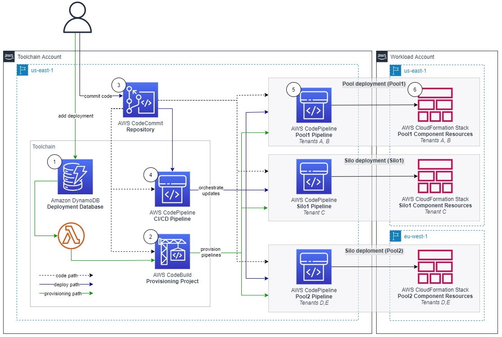

# aws-saas-parallel-deployments

## Summary

This repository contains sample code for the blog post [Parallel and dynamic SaaS deployments with CDK Pipelines](https://aws.amazon.com/blogs/devops/parallel-and-dynamic-saas-deployments-with-cdk-pipelines/).

## Solution overview

Many customers today use AWS CodePipeline to build, test and deploy their cloud applications. For a SaaS provider, considering using a single pipeline for managing all the deployments present concerns. A single pipeline with potentially hundreds of actions runs the risk of becoming throughput limited. A single pipeline would also limit control in how changes are released. This solution approaches this problem by having a separate dynamically provisioned pipeline for each pool and silo deployment.



This solutions is separated into two primary high level solution flows: silo and pool pipeline provisioning (1 and 2), and component code deployment (3 and 4).

Provisioning is separated into a dedicated flow, so that code deployments do not interfere with tenant onboarding, and vice versa. At the heart of the provisioning flow is the deployment database (1), implemented using an Amazon DynamoDB table.

Utilizing DynamoDB Streams and AWS Lambda Triggers, a new AWS CodeBuild provisioning project build (2) is automatically started after a record is inserted into the deployment database. The provisioning project directly provisions new silo and pool pipelines by using the "cdk deploy" command. Provisioning events are processed in parallel, so that the solution can handle possible bursts in tenant onboarding volumes.

CDK best practices suggest that infrastructure and runtime code live in the same package. A single AWS CodeCommit repository (3) contains everything needed: the CI/CD pipeline definitions as well as the workload component code. This repository is the source artifact for every CodePipeline pipeline and CodeBuild project.

The CI/CD pipeline (4) is a CDK Pipelines pipeline, and it is responsible for the components Software Development Life Cycle (SDLC) activities. In addition to implementing the update release process, it is expected that most SaaS providers will also implement additional activities. This includes a variety of tests and pre-production environment deployments.

Deployments have two parts: The pipeline (5) and the component resource stack(s) (6) that it manages. The pipelines are deployed to the central toolchain account and region, where as the component resources are deployed to the AWS Account and Region, as specified in the deployments' record in the deployment database.

## Usage

### Prerequisites

The following tools are required to deploy the solution:

* NodeJS version [compatible with AWS CDK](https://docs.aws.amazon.com/cdk/latest/guide/getting_started.html#getting_started_prerequisites)
* The [AWS Command Line Interface](https://aws.amazon.com/cli/) (AWS CLI)
* Git with [git-remote-codecommit](https://docs.aws.amazon.com/codecommit/latest/userguide/setting-up-git-remote-codecommit.html) extension

You will also need:

* One or two AWS accounts:
    * *Toolchain*: Account for the SDLC toolchain: the pipelines, the provisioning project, the repository and the deployment database.
    * *Workload*: Account for the component resources. If you have only a single account, the toolchain account can be used for both purposes.
* Credentials for the AWS account(s) configured in AWS CLI profile(s)

The instructions below use the following placeholders, which you must replace with your specific values:
* \<TOOLCHAIN_ACCOUNT_ID\>: The AWS Account ID for the toolchain account
* \<TOOLCHAIN_PROFILE_NAME\>: The AWS CLI profile name for the toolchain account credentials
* \<WORKLOAD_ACCOUNT_ID\>: The AWS Account ID for the workload account
* \<WORKLOAD_PROFILE_NAME\>: The AWS CLI profile name for the workload account credentials


### Bootstrapping

The toolchain account, and all workload account(s) must be bootstrapped prior to first time deployment.

AWS CDK and our solutions’ dependencies must be installed to start with. The easiest way to do this is to install them locally with npm. First, we need to download our sample code, so that the we have the package.json configuration file available for npm.

Clone the sample code repository from GitHub, and then install the dependencies using npm:

```
git clone https://github.com/aws-samples/aws-saas-parallel-deployments
cd aws-saas-parallel-deployments
npm ci
```

CDK Pipelines requires use of modern bootstrapping. To ensure this is enabled, start by setting the related environment variable:

```
export CDK_NEW_BOOTSTRAP=1
```

Then, bootstrap the toolchain account. You must bootstrap both the region where the toolchain stack is deployed, as well as every target region for component resources. Here, we will first bootstrap only the us-east-1 region, and later you can optionally bootstrap additional region(s).

```
npx cdk bootstrap <TOOLCHAIN_ACCOUNT_ID>/us-east-1 --profile <TOOLCHAIN_PROFILE_NAME>
```

If you have a workload account that is separate from the toolchain account, then that account must also be bootstrapped. When bootstrapping the workload account, we will establish a trust relationship with the toolchain account. Skip this step if you don’t have a separate workload account.

The workload account boostrappings follows the security best practice of least privilege. First create an execution policy with the minimum permissions required to deploy our demo component resources. We provide a sample policy file in the solution repository for this purpose. Then, use that policy as the execution policy for the trust relationship between the toolchain account and the workload account

```
aws iam create-policy --policy-name CDK-Exec-Policy --policy-document file://policies/workload-cdk-exec-policy.json --profile <WORKLOAD_PROFILE_NAME>
npx cdk bootstrap <WORKLOAD_ACCOUNT_ID>/us-east-1 --trust <TOOLCHAIN_ACCOUNT_ID> --cloudformation-execution-policies arn:aws:iam::<WORKLOAD_ACCOUNT_ID>:policy/CDK-Exec-Policy --profile <WORKLOAD_PROFILE_NAME>
```

## Toolchain deployment

Prior to being able to deploy for the first time, you must create a AWS CodeCommit repository for the solution. Create this repository in the toolchain account:

```
aws codecommit create-repository --profile <TOOLCHAIN_PROFILE_NAME> --region us-east-1 --repository-name unicorn-repository
```

Next, you must push the contents to the CodeCommit repository. For this, use the git command together with the git-remote-codecommit extension in order to authenticate to the repository with your AWS CLI credentials. Our pipelines are configured to use the main branch.

```
git remote add unicorn codecommit::us-east-1://<TOOLCHAIN_PROFILE_NAME>@unicorn-repository
git push unicorn main
```

Now we are ready to deploy the toolchain stack:

```
export AWS_REGION=us-east-1
npx cdk deploy --profile <TOOLCHAIN_PROFILE_NAME>
```

### Workload deployments

At this point, our CI/CD pipeline, provisioning project, and deployment database have been created. The database is initially empty.

Note that the DynamoDB command line interface demonstrated below is not intended to be the SaaS providers provisioning interface for production use. SaaS providers typically have online registration portals, wherein the customer signs up for the service. When new deployments are needed, then a record should automatically be inserted into the solutions deployment database.

To demonstrate the solution’s capabilities, first we will provision two deployments, with an optional third cross-region deployment:

1. A pool deployment (pool1) in the us-east-1 region.
2. A silo deployment (silo1) in the us-east-1 region.
3. A pool deployment (pool2) in the eu-west-1 region (optional).

To start, configure AWS CLI environment variables:

```
export AWS_REGION=us-east-1
export AWS_PROFILE=<TOOLCHAIN_PROFILE_NAME>
```

Add the deployment database records for the first two deployments:

```
aws dynamodb put-item --table-name unicorn-deployments --item '{"id": {"S":"pool1"}, "type": {"S":"pool"}, "region": {"S":"us-east-1"}, "account": {"S":"<WORKLOAD_ACCOUNT_ID>"}}'
aws dynamodb put-item --table-name unicorn-deployments --item '{"id": {"S":"silo1"}, "type": {"S":"silo"}, "region": {"S":"us-east-1"}, "account": {"S":"<WORKLOAD_ACCOUNT_ID>"}}'
```

This will trigger two parallel builds of the provisioning CodeBuild project. Use the CodeBuild Console to observe the status and progress of each of the builds.

After the builds have completed, you can use e.g the CodePipeline console to verify that the deployment pipelines were successfully created:

#### Cross-region deployment (optional)
Optionally, also try a cross-region deployment. Skip this part if a cross-region deployment is not relevant for your use case.

First, you must bootstrap the target region in the toolchain and the workload accounts. Bootstrapping of eu-west-1 here is identical to the bootstrapping of the us-east-1 region earlier. First bootstrap the toolchain account:

```
npx cdk bootstrap <TOOLCHAIN_ACCOUNT_ID>/eu-west-1 --profile <TOOLCHAIN_PROFILE_NAME>
```

If you have a separate workload account, then we must also bootstrap it for the new region. Again, please skip this if you have only a single account:

```
npx cdk bootstrap <WORKLOAD_ACCOUNT_ID>/eu-west-1 --trust <TOOLCHAIN_ACCOUNT_ID> --cloudformation-execution-policies arn:aws:iam::<WORKLOAD_ACCOUNT_ID>:policy/CDK-Exec-Policy --profile <WORKLOAD_PROFILE_NAME>
```

Then, add the cross-region deployment:

```
aws dynamodb put-item --table-name unicorn-deployments --item '{"id": {"S":"pool2"}, "type": {"S":"pool"}, "account": {"S":"<WORKLOAD_ACCOUNT_ID>"}, "region": {"S":"eu-west-1"}}'
```

This concludes the basic demostration of the solution. You can use the CodePipeline console to verify that the deployment pipelines were successfully created in the toolchain account, and use the CloudFormation console to verify that the stacks containing your component resources were deployed to the workload account.

## Configuration

The file lib/configuration.ts contains the solution's configurable variables:

```
DEPLOYMENT_TABLE_NAME = 'unicorn-deployments'
REPOSITORY_NAME = 'unicorn-repository'
CDK_VERSION = '1.145.0'

export const TOOLCHAIN_ENV = {
  region: process.env.CDK_DEFAULT_REGION,
  account: process.env.CDK_DEFAULT_ACCOUNT,
};
```

Note that:
* CDK_VERSION should match the version of aws-cdk as pinned in package.json.
* The AWS Account and Region can (and should for any persistent use cases) be set statically here instead of the default dynamic lookup variables.
* The usage instructions above will require adjustments if the configuration is changed from the defaults.

## Security

See [CONTRIBUTING](CONTRIBUTING.md#security-issue-notifications) for more information.

## License

This library is licensed under the MIT-0 License. See the LICENSE file.

